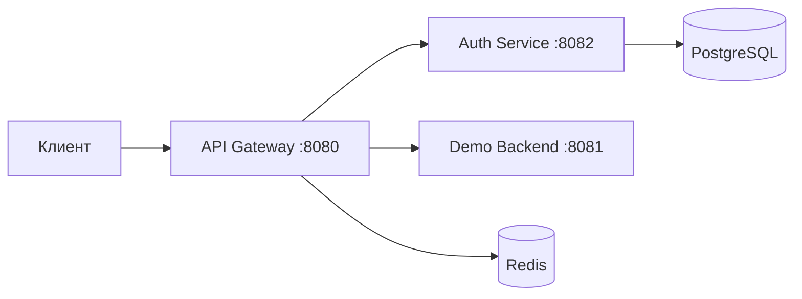

# Musical Greetings – Auth & Gateway

Сервисы аутентификации и API Gateway, выделенные из командного проекта Генерации музыкальных поздравлений, который был создан в рамках летней школы Яндекса.

Вместо полноценного сервиса поздравлений используется `demo-backend` с фиксированными ответами.

## Архитектура



| Компонент | Назначение                                                                                                    |
| --- |---------------------------------------------------------------------------------------------------------------|
| `api-gateway` | Маршрутизирует запросы, проверяет JWT, применяет ограничения через Redis, передает доверенные заголовки запроса |
| `auth-service` | Создает анонимных пользователей и сессии, выдает JWT, обрабатывает refresh и logout |
| `demo-backend` | Возвращает справочники и демонстрационный ответ с идентификаторами текущего пользователя и сессии             |
| PostgreSQL | Хранит пользователей и сессии                                               |
| Redis | Хранит состояние ограничителей запросов gateway                                                               |

Стек: Java 25, Spring Boot 4.1.0, Spring Cloud Gateway, Spring Security, Spring Data JPA, Flyway, PostgreSQL 17, Redis 7, Gradle, Docker Compose. Тесты используют JUnit и Testcontainers.

## Функции API Gateway

API Gateway — единая точка входа для клиентских HTTP-запросов. Он проверяет доступ, ограничивает частоту обращений и передает запросы внутренним сервисам.

### Маршрутизация

Gateway выбирает сервис по пути и HTTP-методу из каталога маршрутов. Создание сессии, обновление JWT и завершение сессии направляются в `auth-service`. Остальные запросы из каталога направляются по адресу `CONGRATS_SERVICE_URL`, который в локальном Compose указывает на `demo-backend`.

### Проверка JWT и доступ к маршрутам

Для защищенных запросов gateway извлекает access token из `Authorization: Bearer <JWT>`. Он проверяет подпись HS256, временные ограничения, издателя (`iss`), аудиторию (`aud`) и формат UUID идентификаторов пользователя (`sub`) и сессии (`sid`). Проверка выполняется локально с общим `JWT_SECRET`, без запроса к Auth Service.

Если токен отсутствует или не проходит проверку, gateway возвращает `401` и не передает запрос внутреннему сервису. Публичные маршруты доступны без JWT. Для обновления токена и завершения сессии клиент передает `X-Refresh-Token`, который проверяет Auth Service.

### Передача доверенных данных пользователя

Перед отправкой запроса внутреннему сервису gateway удаляет клиентские `X-User-Id`, `X-Session-Id` и `Authorization`. Для запроса с проверенным JWT он устанавливает `X-User-Id` из поля `sub` и `X-Session-Id` из поля `sid`.

Клиент не имеет прямого доступа к внутреннему сервису.

### Ограничение частоты запросов

Gateway использует Redis для индивидуальных и общих ограничений по запросам. Для публичных запросов индивидуальный лимит определяется IP-адресом клиента, для защищенных — идентификатором пользователя. Общий лимит ограничивает суммарные обращения к конкретному маршруту.

При превышении лимита gateway возвращает `429` с заголовком `Retry-After`.

### Диагностика и ошибки

Gateway сохраняет допустимый входящий `X-Request-Id` или создает новый, передает его внутреннему сервису и добавляет в ответ. Логи содержат маршрут, метод, путь, HTTP-статус, длительность обработки и идентификатор запроса.

Реализованы метрики и трассировка с экспортом в Monium; в локальном Compose экспорт отключен.

## Функции Auth Service

Auth Service управляет анонимными пользователями, сессиями и токенами. Данные пользователей и сессий хранятся в PostgreSQL.

### Создание анонимного пользователя и сессии

Auth Service создает нового пользователя типа `ANONYMOUS` и связанную с ним сессию.

Сервис возвращает `201` с полями `jwt` и `refresh_token`. Access token используется для защищенных запросов через gateway, refresh-токен — для обновления JWT и завершения сессии.

### Выпуск access token

Сервис подписывает JWT алгоритмом HS256. Токен содержит идентификатор пользователя (`sub`), идентификатор сессии (`sid`), издателя (`iss`), аудиторию (`aud`), время выпуска (`iat`), срок действия (`exp`) и уникальный идентификатор токена (`jti`). В заголовок JWT добавляется идентификатор ключа `kid`.

Срок действия access token по умолчанию — 15 минут. Секрет, издатель и аудитория должны соответствовать настройкам gateway.

### Хранение refresh-токена и состояния сессии

Сервис генерирует refresh-токен, в PostgreSQL сохраняется SHA-256-хеш токена.
Сессия хранит идентификатор пользователя, время создания, срок действия и время отзыва. Она считается активной, если срок еще не истек и сессия не отозвана.

### Обновление JWT

Сервис принимает refresh-токен в заголовке `X-Refresh-Token`, находит активную сессию, продлевает ее срок и возвращает новый `jwt`.
Неизвестный, истекший или отозванный refresh-токен приводит к ответу `401`.

### Завершение сессии

Сервис принимает refresh-токен в заголовке `X-Refresh-Token`, находит активную сессию и записывает время ее отзыва. Дальнейшее обновление JWT по этому refresh-токену запрещено.

## Запуск в Docker

Скачать проект

```bash
git clone https://github.com/maryarta/musical-greetings-auth-gateway.git
cd musical-greetings-auth-gateway
cp .env.example .env
```

Заполнить `.env`:

```dotenv
POSTGRES_DB=musical_auth
POSTGRES_USER=musical
POSTGRES_PASSWORD=replace_with_local_password
JWT_SECRET=replace_with_generated_base64_secret
```

Заменить пароль и сгенерировать JWT-секрет:

```bash
openssl rand -base64 32
```

Вставить результат в `JWT_SECRET`. Auth Service и gateway получают один секрет из Compose. `.env.example` содержит пример настроек.

```bash
docker compose config --quiet
docker compose up --build -d
```

## Доступные эндпоинты демо

Все пути вызываются через gateway.

| Метод | Путь | Доступ / данные               | Успешный ответ |
| --- | --- |-------------------------------| --- |
| POST | `/api/v1/auth/anonymous` | Без токена и тела запроса     | `201`, поля `jwt` и `refresh_token` |
| POST | `/api/v1/auth/refresh` | Заголовок `X-Refresh-Token`   | `201`, поле `jwt` |
| POST | `/api/v1/auth/logout` | Заголовок `X-Refresh-Token`   | `204`, без тела |
| GET | `/api/v1/holidays` | Публичный                     | `200`, список праздников |
| GET | `/api/v1/holidays/{holidayId}` | Публичный (ID 1 или 2)        | `200`, название праздника |
| GET | `/api/v1/music-types` | Публичный                     | `200`, список жанров |
| GET | `/api/v1/congrats/history` | `Authorization: Bearer <JWT>` | `200`, демонстрационные данные пользователя |

Неизвестный эндпоинт возвращает `404`. Для защищенного маршрута без действующего JWT ожидается `401`. При превышении лимита gateway возвращает `429` с `Retry-After`.